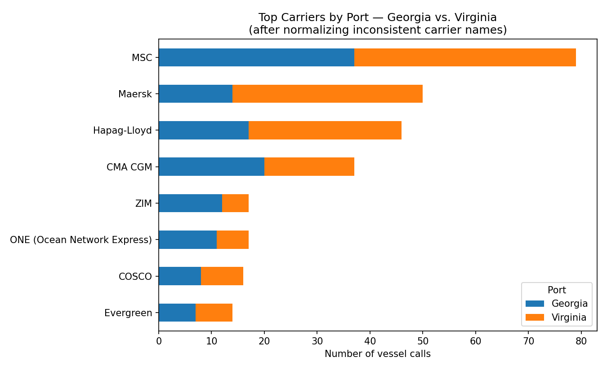

# Port Vessel Schedule Analysis

Comparing container ship traffic across two U.S. East Coast ports — the
Georgia Ports Authority (Savannah) and The Port of Virginia — by pulling
their live, public vessel schedule exports, cleaning them, and merging
them into one comparable dataset.

## Why

Built as a hands-on demonstration of the kind of work described in a
graduate research assistant role: cleaning real-world data, merging
datasets with different structures, and producing accurate descriptive
statistics — using an LLM (Claude) as a tool throughout the process to
help plan the approach, diagnose data issues, and write/debug the code.

## Data sources

- [Georgia Ports Authority — Vessel Schedule](https://gaports.com/vessel-schedule/) (Garden City Terminal + Ocean Terminal exports)
- [The Port of Virginia — Vessel Schedule](https://operations.portofvirginia.com/vessel-schedules/)

Both are public, live operational exports (CSV download built into each
port's own website), pulled August 2026.

## Pipeline

Run everything from the `scripts/` folder:

```
python run_pipeline.py
```

This runs, in order:

| Step | Script | What it does |
|---|---|---|
| 1 | `load_georgia.py` | Loads both Georgia CSVs, fixing a real unquoted-comma parsing bug |
| 2 | `standardize.py` | Stacks the two Georgia terminals, standardizes both ports into one common schema, computes arrival delay where possible |
| 3 | `clean_carriers.py` | Normalizes inconsistent carrier name variants (e.g. "MAERSK" / "MAERSK INC" / "MAERSK LINE" → "Maersk") |
| 4 | `build_chart.py` | Produces the carrier-volume comparison chart |

## Key findings & data issues

**1. Unquoted commas broke CSV parsing.** The Georgia Garden City export
failed to load on the first attempt — 117 of 143 rows had more fields
than expected. Root cause: two text fields (`vessel_class`, listing
multiple crane classes like `"A, B, C"`, and `vsl_operator`, containing
unquoted suffixes like `", INC"`) had commas embedded in the data
itself. Fixed with a two-stage repair: strip known corporate-suffix
commas first, then re-merge any still-mismatched fields back into
`vessel_class`. The loader raises an error if any row still doesn't
match the expected column count, so bad data can't silently pass through.

**2. The two ports structure "delay" differently — and that's a real
limitation, not a bug.** Georgia's export stores both an *estimated*
and an *actual* arrival time in the same row, so schedule delay
(`actual − estimated`) is directly computable. Virginia's export is a
live snapshot with a single `Arrival Time` field whose meaning depends
on vessel status — an estimate if the ship hasn't arrived yet, the
actual time once it has — with no memory of the original estimate once
it's overwritten. This means arrival delay could only be computed for
Georgia (6 of 154 rows had both values available) and not for Virginia
from this file alone. Comparing on-time performance across ports would
require capturing repeated snapshots over time, not a single pull.

**3. Carrier names weren't consistent, even within one port.** Before
cleanup, the two ports' data contained 35 distinct carrier name
strings — but several were the same real company written differently
(`"MSC"` vs. `"Mediterranean Shipping Company S.A."`, `"MAERSK"` vs.
`"MAERSK INC"` vs. `"MAERSK LINE"`, etc.). Without normalizing these,
any carrier-volume analysis would understate real carriers and
overstate how many distinct carriers serve each port. After applying
a keyword-based normalization pass, this dropped to 22 real carriers,
and the top-carrier ranking changed meaningfully as a result (MSC and
Maersk moved to the top after merging their split counts).

## Result



MSC and Maersk are the two largest carriers across both ports combined.
CMA CGM is notable as the one top carrier with *more* volume at Georgia
than at Virginia — every other major carrier in the top 8 leans toward
Virginia.

## Tech

Python, pandas, matplotlib. No external scraping libraries were needed
in the end — both ports' schedule tools have a built-in CSV export,
found by inspecting each site's network requests in Chrome DevTools
rather than parsing rendered HTML.

## Next steps

- Model arrival delay as a function of carrier, terminal, and season
  (`delay ~ carrier + terminal + season`) — a natural next step once
  more Georgia snapshots are collected over time, since the current
  6-row sample is too small to model reliably.
- Automate repeated daily snapshots (e.g. via a scheduled script) to
  build a real time series and make delay comparable across both ports.
- Add a third port (JAXPORT data already pulled, not yet integrated)
  for a cargo-type comparison, since its export includes vessel type
  (container/vehicle/bulk) that neither Georgia nor Virginia captures.
